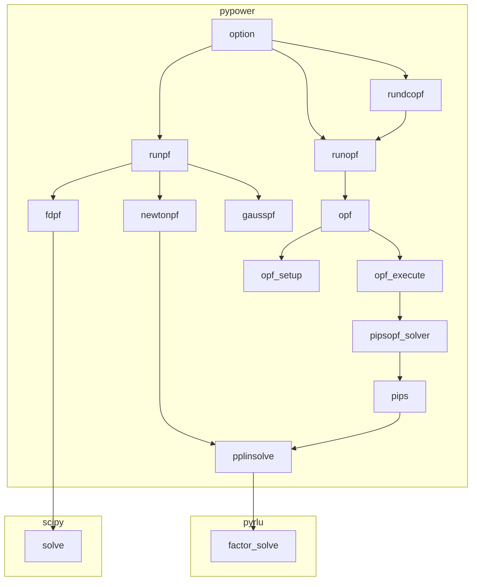

PyPOWER Flow Diagram

```mermaid
  flowchart TD
  
      subgraph pypower
  
          option ---> runpf
          option ---> runopf
          option --> rundcopf
          
          rundcopf --> runopf
  
          runpf --> fdpf
          runpf --> newtonpf
          runpf --> gausspf
  
          newtonpf -----> pplinsolve
  
          runopf --> opf
          opf --> opf_setup
          opf --> opf_execute
  
          opf_execute --> pipsopf_solver
  
          pipsopf_solver --> pips
  
          pips --> pplinsolve
      end
  
      fdpf ------> solve
      pplinsolve --> factor_solve
  
      subgraph scipy
          solve
      end
  
      subgraph pyrlu
          factor_solve
      end
```
